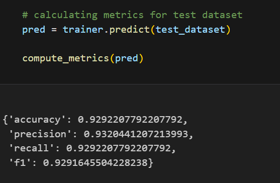

# Customer Support Intent Classifier (DistilBERT)


## Overview

This repository contains the training pipeline for a DistilBERT-based intent classification model designed for customer support applications.

The model is fine-tuned on the PolyAI/banking77 dataset to classify user queries into predefined intent categories. It is optimized for high accuracy while maintaining low inference latency, making it suitable for real-time AI systems.

Due to model size limitations on GitHub, the trained model and tokenizer are hosted on Hugging Face.

---

## Model Access

The trained model is available here:

👉 https://huggingface.co/mr-checker/fin-customer-support-intent-distilbert

---

## Key Features

- Fine-tuned DistilBERT for intent classification  
- 77-class multi-intent support  
- Optimized for real-time inference  
- Clean and modular training pipeline  
- Production-oriented preprocessing and evaluation  

---

## Dataset

- Name: PolyAI/banking77  
- Type: Customer support queries  
- Language: English  
- Classes: 77 intents  

---

## Training Details

- Model: distilbert-base-uncased  
- Epochs: 10  
- Batch Size: 16  
- Max Sequence Length: 64  
- Optimizer: AdamW  
- Evaluation: Accuracy, Precision, Recall, F1  

---

## Performance



<!-- | Metric     | Score |
|-----------|------|
| Accuracy  | ~0.92 |
| Precision | ~0.93 |
| Recall    | ~0.92 |
| F1 Score  | ~0.92 | -->

---

## Training Pipeline

The pipeline includes:

1. Data loading and preprocessing  
2. Tokenization using Hugging Face tokenizer  
3. Train / Validation / Test split  
4. Fine-tuning using Hugging Face Trainer  
5. Evaluation using weighted metrics  
6. Model and tokenizer export  

---

## Usage 

```python
from transformers import pipeline

classifier = pipeline(
    "text-classification",
    model="your-username/fin-customer-support-intent-distilbert"
)

print(classifier("I lost my card"))
```

